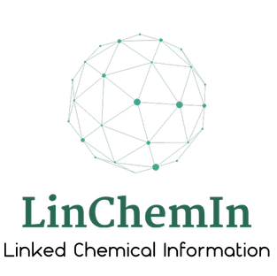

  
  
  
  
 

## LinChemIn (Linked Chemical Information)  

The Linked Chemical Information (LinChemIn) package is a python toolkit that allows chemoinformatics operations on synthetic routes and reaction networks.  

## Authors and Maintainers
[Marta Pasquini](mailto:marta.pasquini@syngenta.com)  
[Marco Stenta](mailto:marco.stenta@syngenta.com)  

## Resources  
|resource type|link| 
|---|---|
|project page|https://linchemin.github.io|
|repository|https://github.com/syngenta/linchemin   |
|documentation|http://linchemin.readthedocs.io|
|pypi page|https://pypi.org/project/linchemin|

## Install for usage  
### 1) pypi  
>pip install linchemin  
> 
### 2) clone & pip   
>git clone https://github.com/syngenta/linchemin    
>cd linchemin    
>pip install .   

### 3) pip from git  
>pip install git+https://github.com/syngenta/linchemin

## Install for development  
>git clone https://github.com/syngenta/linchemin  
>cd linchemin  
>pip install -e .[dev]    

Testing is based on pytest  
